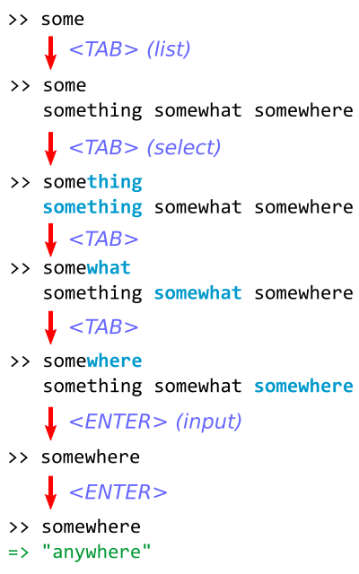

# Rails: Support Auto-Completion in Web Console

## 0. Contact

- Name: Hiroyuki Sano
- Email Address: sh19910711 at gmail.com
- GitHub Username: [@sh19910711](https://github.com/sh19910711)
- College/University: The University of Aizu, Japan
- Subject/Major: Computer Science and Engineering

## 1. Synopsis

_[Web Console](https://github.com/rails/web-console)_ is a debugging tool for the web apps built with Ruby on Rails. In order
to debug the web apps, It provides an interactive Ruby session to the developers.
The console is displayed in the current page of the browser, and its session stores
context of running code of the web app. It allows us to debug the web apps interactively.

This project aims to make a better user experience for Web Console as a whole,
and the main focus is to support _"auto-completion"_ feature in the console, which
is to help us typing commands speedy and quickly on console.

Also, this project is getting into ways to extend Web Console. The main goal of
the project is to create _built-in commands_ and its architecture, which makes Web
Console more extendable, and it can open the door to yet another contributors.

## 2. Description

In GSoC 2016 terms, I would be working on three subjects:

* _Auto-completion_
* Console fired from _"anywhere"_
* _Built-in commands_
* And other stuffs
  - More _browser extensions_
  - _Colored console_

### I. Support "auto-completion"

It is a feature to help typing commands. For example, if people type the TAB key
when typing the prefix of some commands, then it shows the list of possible commands
from the prefix.

At first, to make it simpler, I will only support general parts:

* `keywords`
* `objects`
* `constants`

And next, I will try to support extra parts like `methods`.

#### Sketch of use cases



### II. Console fired from "anywhere"

Recently, Web Console have gotten to be able to spawn a console anywhere in a web
app. However, it haven't supported requests like Web API yet, and so, precisely,
it's not that we can call Web Console anywhere.

#### config.web_console.anywhere

In order to acutually fire the `console` method from anywhere, I will add
a configuration as following:

```ruby
class Application < Rails::Application
  config.web_console.anywhere = true
end
```

#### Support Web API

First, Web Console is watching all requests via XMLHttpRequest, and if the response
header contains the specific header for Web Console, then console is installed into
the target element. Last year, I have added "`X-Web-Console-Session-Id`" as a custom
header for browser extensions, and so we can use this header to detect either the
`console` method is fired.

And so, if a configuration like the above is enabled, Web Console always inserts its script code
into the head of the `<head>` tag as following:

```html
<html>
  <head>
    <!-- Inserted Script -->
    <script id="web-console-xhr">
      (function(open) {
        XMLHttpRequest.prototype.open = function(_args_) {
          this.addEventListener('readystatechange', function() {
            if (this.readyState === 4) {
              var header = 'X-Web-Console-Session-Id';
              var sessionId = this.getResponseHeader(header);
              if (sessionId) {
                REPLConsole.installInto('console');
              }
            }
          }, false);
          open.apply(this, arguments);
        };
      })(XMLHttpRequest.prototype.open);
    </script>
    ...
  </head>
  <body>
    ...
    <div id="console"></div>
  </body>
</html>
```

#### Extra task: Support a process of loading resources

Supporting Web API is not covering "anywhere". We also need to support loading resources
by the `src` property of HTML tags (e.g., ``, `<script>`). I guess that we can
also hijack a process of them in the similar way as Web API.

### III. Create built-in commands and its architecture

#### Base Class

```ruby
class WebConsole::Command
  # This method should be overrided in client-side commands.
  # As default, it will communicate with a server-side action.
  def script
    <<-EOF
      // Send request to the server to call an action method.
      // And then, render the result to the console.
    EOF
  end
end
```

#### Example of server-side command

```ruby
# lib/web_console/commands/list.rb
class List < WebConsole::Command
  short_name "ls"
  usage <<-EOF
    ls [Context]...
    ...
  EOF

  def action(session_id, ctx = 'self')
    s = WebConsole::Session.find(session_id)
    @local_variables = s.eval_raw("#{ctx}.local_variables if #{ctx}.respond_to?(:local_variables)")
    @instance_variables = s.eval_raw("#{ctx}.instance_variables if #{ctx}.respond_to?(:instance_variables)")
    @methods = s.eval_raw("#{ctx}.methods if #{ctx}.respond_to?(:methods)")
  end

  def view
    <<-EOF
    local variables: #{@local_variables.join(', ')}
    instance variables: #{@instance_variables.join(', ')}
    methods: #{@methods.join(', ')}
    EOF
  end
end
```

#### Example of client-side command

```ruby
# lib/web_console/commands/config.rb
class Config < WebConsole::Command
  usage <<-EOF
    config [key=value]
    ...
  EOF

  def script
    <<-EOF
      // This function is called when the command is called on console.
      function(expr) {
        // Let "console" is REPLConsole.currentSession.
        var confirmed = new REPLConsole.Deferred;

        var configView = ...;
        configView.onChange = function(key, value) {
          console.setConfig(key, value);
        };
        configView.onClose = function() {
          console.removeBelowConsole(configView);
          confirmed.resolved(); // new prompt is created
        };

        if (expr != "") {
          // e.g., "key=value"
          console.setConfig(parseKey(expr), parseValue(expr));
          return "updated";
        } else {
          // Show config view
          console.addBelowConsole(configView);
          return closed; // We can stop creating new prompt by a Deferred object.
        }

        function parseKey(expr) { ... }
        function parseValue(expr) { ... }
      }
    EOF
  end
end
```

#### The `config` command: Client-side user options

TBD

#### The `ls` command: Show context information

TBD

#### The `man` command: Read document

TBD

### IV. Extra stuffs

#### More browser extensions

Last year I have developed a prototype of a Google Chrome extension and touched on
a Firefox add-on. This year, I will make the chrome extension is production ready,
and touch on Firefox and Safari support.

#### Colored Console

This feature is to color a command and its output. For example, if the command returns
a string object, the string is colored by some color to distinguish with other types.

## 3. Milestones

Here is a timeline:

### 22 Apr. - 22 May.

#### Milestone #0: TBD (Community Bonding Period):

* TBD

### 23 May. - 27 Jun.

#### Milestone #1: TBD (First-Term)

* TBD

### 28 Jun. - 23 Aug.

#### Milestone #2: TBD (Second-Term)

* TBD

## 4. Experience

### GSoC 2015

Last year, I have developed a prototype of a Google Chrome browser extension (see [rails/web-console#151](https://github.com/rails/web-console/pull/151)), and
have tackled the client-side testing environment (see [rails/web-console#138](https://github.com/rails/web-console/pull/138)). My mentor [@gsamokovarov](https://github.com/gsamokovarov) took
enough time to review my submitting patches, and he gave me many valuable advices.
In the process, I have had many rejects, but thanks to that I had been able to write a pretty solid code as a whole.

### Merged pull requests on rails/web-console

* [rails/web-console#127](https://github.com/rails/web-console/pull/127) - "Replace Session::INMEMORY_STORAGE with a class variable"
* [rails/web-console#131](https://github.com/rails/web-console/pull/131) - "Cleanup template scripts"
* [rails/web-console#132](https://github.com/rails/web-console/pull/132) - "Update .travis.yml for ruby-2.2.x"
* [rails/web-console#138](https://github.com/rails/web-console/pull/138) - "Add JavaScript test environment"
* [rails/web-console#139](https://github.com/rails/web-console/pull/139) - "Some changes for DOM manipulation"
* [rails/web-console#140](https://github.com/rails/web-console/pull/140) - "Add 'close button'"
* [rails/web-console#144](https://github.com/rails/web-console/pull/144) - "Change 'REPLConsole.session' to store only the latest single session"
* [rails/web-console#145](https://github.com/rails/web-console/pull/145) - "Require versioning in accept header"
* [rails/web-console#146](https://github.com/rails/web-console/pull/146) - "Add "X-Web-Console-Session-Id" to response headers"
* [rails/web-console#149](https://github.com/rails/web-console/pull/149) - "Extend REPLConsole.installInto() to accept argument options"
* [rails/web-console#151](https://github.com/rails/web-console/pull/151) - "Add Chrome Extension"
* [rails/web-console#154](https://github.com/rails/web-console/pull/154) - "Change to use fixed mount point for the Web API"
* [rails/web-console#157](https://github.com/rails/web-console/pull/157) - "Show an error message when an error response does not have JSON"
* [rails/web-console#158](https://github.com/rails/web-console/pull/158) - "Implicitly return exit status on the "test:templates" rake task"
* [rails/web-console#159](https://github.com/rails/web-console/pull/159) - "Wait for started up a web server after rackup on the 'test:templates'"
* [rails/web-console#160](https://github.com/rails/web-console/pull/160) - "Update for i18n supports"
* [rails/web-console#161](https://github.com/rails/web-console/pull/161) - "Add X-Web-Console-Mount-Point"

### Works

Here is a brief information:

- social-snippet (Ruby) # Working in Progress Now (but it should prove something of my skills)

  This is my open source software written in Ruby.
  It is a snippet manager for programming competitions.

  * URL: https://social-snippet.github.io
  * URL: https://github.com/social-snippet/social-snippet

- duck-lang (C, Language)

  A simple scripting language based on the idea of duck-typing.
  I have added some language-syntax and tests.

  * URL: https://github.com/gregtour/duck-lang

- git-contest (Ruby, Git)

  This is my open source software written in Ruby.
  It is a Git extension for programming competitions (e.g, Google Code Jam).

  * URL: https://github.com/sh19910711/git-contest
  * Poster for "Ruby World Conference 2014" in Japan

- git (C, Git)

  Git is a free and open source distributed version control system.
  I added small improvement [1] of git-fsck command.

  * URL: http://git-scm.com/
  * My Commit: https://github.com/git/git/commit/effd12ec876df016d4346fee0d3d6bf31308fa11

- tilt-fs (Ruby)

  This is my open source software written in Ruby.
  It is a userspace filesystem based on Tilt.

  * URL: https://github.com/sh19910711/ruby-tilt-fs

- search-plus (Chrome Extension)

  This is my open source software (WIP).
  It can find all tabs you're looking for.

  * URL: https://chrome.google.com/webstore/detail/search-plus/cdpohbejnbclggljmoijjcpdhbaaijfm
  * URL (WIP): https://github.com/sh19910711/crx-search-plus

- Other Projects and Activities

  * GitHub: https://github.com/sh19910711
  * RubyGems: https://rubygems.org/profiles/sh19910711

## 5. Others

### Why did you choose this project?

Basically, whatever, I am interested in the tools from debugging, because it allows
me to eat my own dog food.

### Why are you interested in Open Source?

It leads to well-designed software. Generated things from open source are not only
source code but also approaches how to create software. There are many things to
learn from open source. For example, I like testing software, and I have been able
to learn many things about testing from open source.

### How long will the project take? When can you begin?

TBD

### How much time do you expect to dedicate to this project?

I can dedicate 40 hours per a week on this project.

### Where will you based during the summer?

Aizu-wakamatsu, Japan.

### What timezone will you be working in and what hours do you plan to work?

I'm at JST, which is UTF+09:00.

### Do you have any commitments for the summer? (holidays/work/courses)

No.

### Why do you want to participate and why should Ruby org choose you?

I need to participate GSoC because I have to earn money to live as a student.
After GSoC, I want to keep contributing to Web Console and Ruby org (including
Ruby on Rails community).
