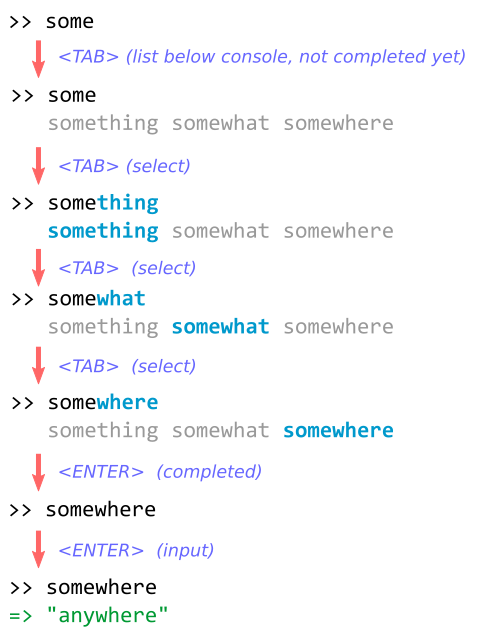

# Rails: Support Auto-Completion in Web Console

## 0. Contact

- Name: Hiroyuki Sano
- Email Address: sh19910711 at gmail.com
- GitHub Username: [@sh19910711](https://github.com/sh19910711)
- College/University: The University of Aizu, Japan
- Subject/Major: Computer Science and Engineering

## 1. Synopsis

Web Console is a debugging tool for the web apps built with Ruby on Rails. In order
to debug the web apps, It provides an interactive Ruby session to the developers.
The console is displayed in the current page of the browser, and its session stores
context of running code of the web app. It allows the developers to debug the web
apps interactively.

This project aims for making a better user experience for Web Console as a whole,
and the main focus is to support "Auto-completion" feature in the console.

## 2. Description

### I. Support auto-completion

For example, if people type the TAB key when typing the prefix of some commands,
then it shows the list of possible commands from the prefix.

At first, to make it simpler, I will only support general parts:

* `keywords`
* `objects`
* `constants`

And next, I will try to support extra parts like `methods`.

#### Sketch of use cases



### II. Console fired from Web API

Recently, Web Console have gotten to be able to spawn a console anywhere in a web
app. However, it haven't supported requests like Web API yet, and so, precisely,
it's not true that we can call Web Console anywhere.

#### config.web_console.anywhere

In order to acutually fire the `console` method from anywhere, I will add
a configuration as following:

```ruby
class Application < Rails::Application
  config.web_console.anywhere = true
end
```

#### Listen Web API requests

If the configuration like above is enabled, Web Console always inserts its script code
into the head of the `<head>` tag as following:

```html
<html>
  <head>
    <script id="web-console-xhr">
      (function(open) {
        XMLHttpRequest.prototype.open = function(_args_) {
          this.addEventListener('readystatechange', function() {
            if (this.readyState === 4) {
              var header = 'X-Web-Console-Session-Id';
              var sessionId = this.getResponseHeader(header);
              if (sessionId) {
                REPLConsole.installInto('console');
              }
            }
          }, false);
          open.apply(this, arguments);
        };
      })(XMLHttpRequest.prototype.open);
    </script>
    ...
  </head>
  <body>
    ...
    <div id="console"></div>
  </body>
</html>
```

It is watching all requests via XMLHttpRequest, and if the response header contains
`X-Web-Console-Session-Id`, then console is installed into the target element.

#### Console fired by loading resources (extra task)

I guess that we can also hijack resources loaded by the `src` property.

### III. Built-in commands

#### The `config` command: Client-side user options

TBD

#### The `ls` command: Context viewer

TBD

### Create more browser extensions

TBD

### Decorate well-known command outputs

TBD

## 3. Milestones

Here is a timeline:

### 22 Apr. - 22 May.

#### Milestone #0: TBD (Community Bonding Period):

* TBD

### 23 May. - 27 Jun.

#### Milestone #1: TBD (First-Term)

* TBD

### 28 Jun. - 23 Aug.

#### Milestone #2: TBD (Second-Term)

* TBD

## 4. Experience

### GSoC 2015

Last year, I have developed a prototype of a Google Chrome browser extension, and
have tackled the client-side testing environment.

[@gsamokovarov](https://github.com/gsamokovarov) took enough time to review my submitting patches, and he gave me many
valuable advices. In the process, I have had many rejects, but thanks to that
I had been able to write a pretty solid code as a whole.

### Merged pull requests on rails/web-console

* [rails/web-console#127](https://github.com/rails/web-console/pull/127) - "Replace Session::INMEMORY_STORAGE with a class variable"
* [rails/web-console#131](https://github.com/rails/web-console/pull/131) - "Cleanup template scripts"
* [rails/web-console#132](https://github.com/rails/web-console/pull/132) - "Update .travis.yml for ruby-2.2.x"
* [rails/web-console#138](https://github.com/rails/web-console/pull/138) - "Add JavaScript test environment"
* [rails/web-console#139](https://github.com/rails/web-console/pull/139) - "Some changes for DOM manipulation"
* [rails/web-console#140](https://github.com/rails/web-console/pull/140) - "Add 'close button'"
* [rails/web-console#144](https://github.com/rails/web-console/pull/144) - "Change 'REPLConsole.session' to store only the latest single session"
* [rails/web-console#145](https://github.com/rails/web-console/pull/145) - "Require versioning in accept header"
* [rails/web-console#146](https://github.com/rails/web-console/pull/146) - "Add "X-Web-Console-Session-Id" to response headers"
* [rails/web-console#149](https://github.com/rails/web-console/pull/149) - "Extend REPLConsole.installInto() to accept argument options"
* [rails/web-console#151](https://github.com/rails/web-console/pull/151) - "Add Chrome Extension"
* [rails/web-console#154](https://github.com/rails/web-console/pull/154) - "Change to use fixed mount point for the Web API"
* [rails/web-console#157](https://github.com/rails/web-console/pull/157) - "Show an error message when an error response does not have JSON"
* [rails/web-console#158](https://github.com/rails/web-console/pull/158) - "Implicitly return exit status on the "test:templates" rake task"
* [rails/web-console#159](https://github.com/rails/web-console/pull/159) - "Wait for started up a web server after rackup on the 'test:templates'"
* [rails/web-console#160](https://github.com/rails/web-console/pull/160) - "Update for i18n supports"
* [rails/web-console#161](https://github.com/rails/web-console/pull/161) - "Add X-Web-Console-Mount-Point"

## 5. Others

### Why are you interested in Open Source?

It leads to well-designed software. Generated things from open source are not only
source code but also approaches how to create software. There are many things to
learn from open source. For example, I like testing software, and I have been able
to learn many things about testing from open source.

### How long will the project take? When can you begin?

TBD

### How much time do you expect to dedicate to this project? (weekly)

I can dedicate 40 hours per a week on this project.

### Where will you based during the summer?

Aizu-wakamatsu, Japan.

### What timezone will you be working in and what hours do you plan to work?

I'm at JST, which is UTF+09:00.

### Do you have any commitments for the summer? (holidays/work/summer courses)

No.
